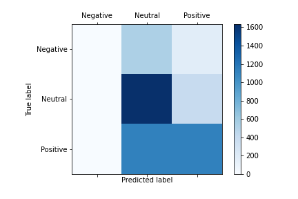
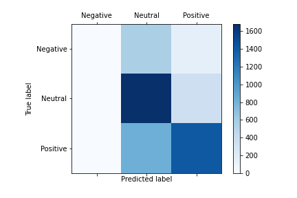
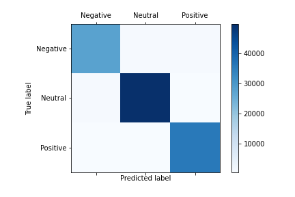

# From Sentiment Analysis to Emotion Recognition

Students:

	- Ingrid Pérez Aguilera				NIA: 205536 
  	  Email: ingrid.perez03@estudiant.upf.edu

	- Clara Reolid Sánchez				NIA: 207531 
  	  Email: clara.reolid01@estudiant.upf.edu 

	- Gerard Planell Bosch				NIA: 207533
  	  Email: gerard.planell01@estudiant.upf.edu 
	  
Practice group: 102

Group: 1

## Problem Description 

Sentiment analysis is the problem of analysing text data in order to identify and categorise opinions in order to determine whether the writer’s attitude towards a topic is positive, neutral and negative. Similar to Sentiment analysis, there is Emotional recognition which aims to detect and recognise feelings through the expressions of texts, such as anger, disgust, fear, happiness, sadness, and surprise.

The aim is to create a recurrent neural network to solve the sentiment analysis problem using a dataset that contains tweets labelled as either positive, neutral, or negative. Once the model has been trained, the aim is to adapt the architecture of the recurrent neural network so that it performs accurately the task of emotion recognition on another dataset of tweets. Then, in order to obtain the best possible accuracy the network and the hyper-parameters will be fine-tuned.

## Data

The data can be obtained through the following link: https://drive.google.com/drive/folders/1VO0fUJd0Cm716MC8utI4Pvj72rYX0lgm?usp=sharing

The four datasets that can be found in such file are the following ones:

- Dataset 1: Sentiment Dataset 
[[1](http://alt.qcri.org/semeval2017/task4/index.php?id=results)]
	- Size: 50,337 tweets
	- Labels: 
		- Negative → 0
		- Neutral → 1
		- Positive → 2
	- Data Distribution: 

	

	
- Dataset 2: Sentiment Tweets 
[[2](http://www.t4sa.it/)]

	- Size: 1,179,957 tweets
	- Labels: 
		- Negative → 0
		- Neutral → 1
		- Positive → 2
	- Data Distribution:

	

- Dataset 3: Emotion Dataset 
[[3](https://competitions.codalab.org/competitions/17751#learn_the_details-datasets)]
	- Size: 7,102 tweets
	- Labels: 
		- Sadness → 0
		- Fear → 1
		- Joy → 2
		- Anger → 3
	- Data Distribution: 

	

- Dataset 4: Emotion Tweets 
[[4](https://github.com/omarsar/nlp_pytorch_tensorflow_notebooks)]

	- Size: 416,809 tweets
	- Labels: 
		- Sadness → 0
		- Joy → 1
		- Love → 2
		- Anger → 3
		- Fear → 4
		- Surprise → 5
	- Data Distribution: 

	

	
## Data pre-processing 
In this part we have performed some changes in the tweets so as to remove unecessary information. The steps followed are shown in the next diagram:

	

Besides, we have converted the labels form words to numbers so that it matches the output of the LSTM.

## Architectures

In order to obtain the best possible accuracy, the following two networks were implemented. Both are based on a Long-Short Term Memory (LSTM) neural networks. Such architectures are capable of learning long-term dependencies in the input. 

The two models implemented different in the number of fully connected layers that they have to get the output from the hidden unit. 

1. Network with three fully connected layers: After embedding the input and going through two LSTM layers, the output will be obtained by applying three fully connected layers. The following figure shows the architecture: 

  

		
2. Network with one fully connected layer: Similarly, as before, the input will be embedded and passed through two LSTM layers, but, instead, the output will only be obtained by using one fully connected layer. The architecture is depicted in the following image: 

  

The pre-trained models can be downloaded from the following link: https://drive.google.com/drive/folders/1XMNhAcZ5D7zRp-ivevBlMtFDEdYyYPWH?usp=sharing

In order to replicate the results that we have obtained, it is necessary to run the notebooks in Google Collaboratory. There are four different notebooks one for each dataset and, inside each notebook, there are three different sections, the first part pre-processes the data, the second part runs the first network architecture and the third part, the second network architecture. In order to reproduce the results obtained, it is possible to run the notebooks skipping the training part and loading the already trained models from the .cpkt files. 

To run the notebooks, it is necessary to have the following folder structure in the drive:

- DeepLearning_2020 -> Final_Project
	- Data -> Store the 4 different datasets
	- Results -> Store the 8 different pre-trained models

## Results

The following list summarises the best results obtained for each of the different networks and datasets. 
- Dataset 1: Sentiment Dataset 

	- Parameters:
		- Epochs → 10
		- Hidden Layer → 256
		- Embedding → 400
		- Batch Size → 128
		- Optimiser → Standard Gradient Descent (momentum 0.9)
		- Learning rate → 0.1
	- Results:

		|  Results  | Test Loss  | Accuracy |
		|  :-------:  | :----------: | :-------------: |
		| Network 1 |    0.933 (0.958)  | 60.7% (55.0%) |
		| Network 2  | 0.935 (0.925)  | 60.5% (61.8%) |
	- Confusion Matrix: 
		- Network 1:
			

				
			

		- Network 2:
			

				
			

		

- Dataset 2: Sentiment Tweets
	- Parameters:
		- Epochs → 5
		- Hidden Layer → 256
		- Embedding → 400
		- Batch Size → 128
		- Optimiser → Standard Gradient Descent (momentum 0.9)
		- Learning rate → 0.1
	- Results:

		|  Results  | Test Loss  | Accuracy |
		|  :-------:  | :----------: | :-------------: |
		| Network 1 |    0.596   | 95.4%  |
		| Network 2  | 0.599  | 96.1%  |
	- Confusion Matrix: 
		- Network 1:
			

				
			

		- Network 2:
			

				
			

- Dataset 3: Emotion Dataset 

	- Parameters:
		- Epochs → 10
		- Hidden Layer → 256
		- Embedding → 400
		- Batch Size → 128
		- Optimiser → Standard Gradient Descent (momentum 0.9)
		- Learning rate → 0.1
	- Results:

		|  Results  | Test Loss  | Accuracy |
		|  :-------:  | :----------: | :-------------: |
		| Network 1 |    1.226 (1.378)  | 44.2% (27.7%)  |
		| Network 2  | 1.097 (1.053) | 60.6% (61.0%) |	
	- Confusion Matrix: 
		- Network 1:
			

				
			

		- Network 2:
			

				
			

- Dataset 4: Emotion Tweets 

	- Parameters:
		- Epochs → 5
		- Hidden Layer → 256
		- Embedding → 400
		- Batch Size → 128
		- Optimiser → Standard Gradient Descent (momentum 0.9)
		- Learning rate → 0.1
	- Results:

		|  Results  | Test Loss  | Accuracy |
		|  :-------:  | :----------: | :-------------: |
		| Network 1 |    1.228   | 81.4%  |
		| Network 2  | 1.194  | 84.8%  |
	- Confusion Matrix: 
		- Network 1:
			

				
			

		- Network 2:	
			

				
			

## References

The references are:
1. Sara Rosenthal, Noura Farra, &; Preslav Nakov (2017). SemEval-2017 Task 4: Sentiment Analysis in Twitter. In Proceedings of the 11th International Workshop on Semantic Evaluation. Association for Computational Linguistics. Source: http://alt.qcri.org/semeval2017/task4/index.php?id=results 
2. Vadicamo, L., Carrara, F., Cimino, A., Cresci, S., Dell'Orletta, F., Falchi, F., & Tesconi, M. (2017). Cross-media learning for image sentiment analysis in the wild. In Proceedings of the IEEE International Conference on Computer Vision Workshops (pp. 308-317).
3. Mohammad, S., Bravo-Marquez, F., Salameh, M., &; Kiritchenko, S. (2018). SemEval-2018 Task 1: Affect in Tweets. In Proceedings of International Workshop on Semantic Evaluation (SemEval-2018). Source: https://competitions.codalab.org/competitions/17751#learn_the_details-datasets 
4. Saravia, E. (Unknown) Deep Learning Based NLP. Source: https://github.com/omarsar/nlp_pytorch_tensorflow_notebooks (Accessed on 11th June 2020)
5. Savani, B. (2019). “Tutorial on Sentiment Analysis using Pytorch for beginners”. Medium. Source: https://medium.com/@bhadreshpsavani/tutorial-on-sentimental-analysis-using-pytorch-b1431306a2d7
6. NS, A. (2020). "Multiclass Text Classification using LSTM in Pytorch". Medium. Source: https://towardsdatascience.com/multiclass-text-classification-using-lstm-in-pytorch-eac56baed8df
